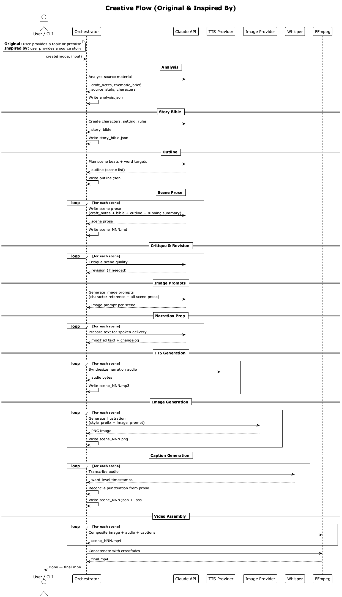
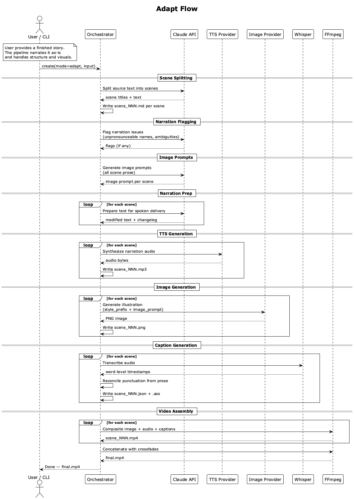

# Story Video Generator

**Note:** this is a work in progress. It might never be completed if I see something shiny and get distracted.

A Python CLI tool that turns a story into a narrated video for YouTube. You give it text, it gives you a video with AI narration, timed captions, and illustrated scenes.

## Why On Earth?

My wife loves to listen to stories on YouTube. I thought it might be fun for her to have a tool that'd help her create
some of her own. And hey, good excuse for getting more reps in with Python.

## How It Works

The pipeline has three input modes:

- **Original** -- You provide a topic or premise. The AI writes the story from scratch.
- **Inspired by** -- You provide an existing story as inspiration. The AI writes something new that captures similar themes and mood.
- **Adapt** -- You provide a finished story. The AI narrates it word for word and handles structure and visuals.

### Creative Flow (Original & Inspired By)

Original and inspired_by share the same 11-phase pipeline. The difference is the input: original takes a topic or premise, inspired_by takes a source story. Both go through analysis, story bible, outline, prose, critique, then into the shared media pipeline.



### Adapt Flow

Adapt mode skips the creative phases. It splits the source text into scenes, flags narration issues, then feeds into the shared media pipeline.



### Resume

The pipeline saves state between phases. If something fails, you resume from where it stopped instead of starting over.

## Tech Stack

Python 3.14, Claude API (writing), OpenAI TTS or ElevenLabs v3 (narration), GPT Image 1.5 (illustrations), Whisper (captions), FFmpeg (video). See `pyproject.toml` for the full dependency list.

## Current Status

All three modes work end-to-end. You can give it a story, a creative brief, or source material and get back a finished video with narration, illustrations, timed captions, and crossfade transitions.

### What's Working

- **Full adapt pipeline** -- 8 phases run sequentially: scene splitting, narration flagging, image prompts, narration prep, TTS, image generation, caption generation, video assembly
- **Original creative flow** -- Provide a topic, premise, or detailed brief. The AI interprets your creative direction, builds characters and setting, outlines the story, writes prose, and revises it before handing off to the media pipeline.
- **Inspired_by creative flow** -- 5 phases: source analysis (craft notes + thematic brief), story bible (characters, setting, rules), outline (scene beats with word targets), scene prose (with running summary), critique/revision (single-pass polish). Feed into the shared media pipeline.
- **LLM-based narration prep** -- Claude API handles abbreviations, numbers, and punctuation contextually instead of brittle regex transforms. Produces a changelog of all modifications.
- **Multi-voice narration** -- YAML front matter defines voice mappings, inline `**voice:name**` tags switch between voices mid-scene. Works with both OpenAI and ElevenLabs.
- **Mood tags** -- inline `**mood:thoughtful**` tags add emotional direction. OpenAI uses its `instructions` parameter; ElevenLabs v3 uses freeform audio tags.
- **Pause tags** -- inline `**pause:1.5**` tags insert silence into narration audio. Useful for pacing, dramatic beats, and poetry.
- **Scene markers** -- `**scene:Title**` tags in your story file let you pre-split scenes. The pipeline auto-detects them and skips the AI splitting step.
- **Two TTS providers** -- OpenAI (`gpt-4o-mini-tts`) and ElevenLabs (v3). Switch via config file.
- **CLI** -- all five commands functional: `create`, `resume`, `estimate`, `status`, `list`
- **Resume from failure** -- pipeline saves state per phase and per scene, picks up where it left off
- **Semi-automated mode** -- pauses at content phases for human review, or runs straight through in autonomous mode
- **Cost estimation** -- projected costs before starting, actual costs after completion
- **971 tests** covering all modules

### Pie in the Sky

- Inline image tags -- author-controlled image transitions within scenes
- Background music / sound effects -- audio overlay with volume and duration control
- Iterative critique/revision -- critic and author personas with multi-pass refinement
- User-configurable story length -- `--target-words`, `--target-scenes` flags
- Web UI
- Story translation

## Usage

```
pip install -e ".[dev]"
```

You'll need FFmpeg installed on your system and API keys in a `.env` file:

```
ANTHROPIC_API_KEY=sk-ant-...
OPENAI_API_KEY=sk-...
ELEVENLABS_API_KEY=...          # optional, only if using ElevenLabs TTS
```

### Multi-Voice Stories

Add a YAML header to your story file to define voice mappings and use inline tags to switch between them:

```
---
voices:
  narrator: nova
  old_man: echo
default_voice: narrator
---
The old man sat alone. **voice:old_man** **mood:dry** "Black or white?"
**voice:narrator** The boy pointed at the black pieces.
```

Use `**pause:N**` tags to insert silence (in seconds) for pacing:

```
The door swung open. **pause:1.5** "Is anyone there?" she whispered.
```

### Scene Markers

If you want to control where scenes split, add `**scene:Title**` tags to your story file:

```
**scene:The Storm**
It was a dark and stormy night. The wind howled through the trees.

**scene:The Journey**
The hero ventured forth bravely into the unknown.
```

When the pipeline detects scene tags, it splits on them directly and skips the AI scene-splitting step. Any text before the first tag becomes a scene titled "Opening".

Voice IDs depend on your TTS provider. OpenAI uses names like `nova`, `echo`, `alloy`. ElevenLabs uses voice ID hashes from your account.

### ElevenLabs

To use ElevenLabs instead of OpenAI for TTS, create a config file:

```yaml
tts:
  provider: elevenlabs
  model: eleven_v3
  output_format: mp3_44100_128
```

Then pass it with `--config`:

```
story-video create --mode adapt --input story.txt --config config_elevenlabs.yaml
```

### Commands

```
story-video create --mode adapt --input story.txt                         # adapt an existing story
story-video create --mode original --input "A love story set in 1920s Paris"  # AI writes from a brief
story-video create --mode inspired_by --input story.txt                   # new story inspired by source
story-video create --mode inspired_by --input story.txt --premise "..."   # with creative direction
story-video create --mode adapt --input story.txt --autonomous            # skip review checkpoints
story-video resume                                    # continue the most recent project
story-video resume <project-id>                       # continue a specific project
story-video estimate --mode adapt --input story.txt  # show cost estimate without starting
story-video status <project-id>                       # show current state of a project
story-video list                                      # list all projects
```

## Development

```
pytest                       # run all tests
pytest -m "not slow"         # skip tests that make real API calls
ruff format                  # format code
ruff check                   # lint
```
